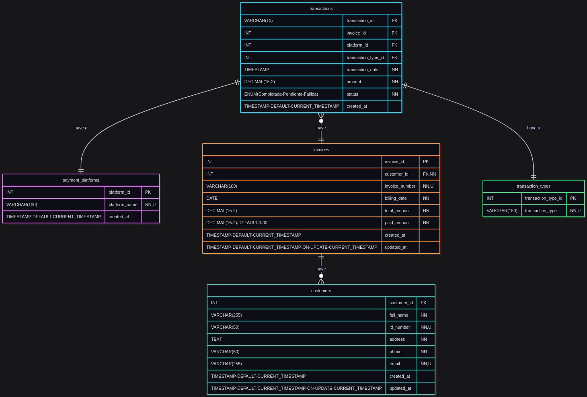

# ExpertSoft Financial Data Management System

A full-stack application developed for ExpertSoft to centralize and manage financial data from Fintech platforms like Nequi and Daviplata. This project transforms disorganized spreadsheet data into a structured, normalized relational database and provides a robust API and a user-friendly dashboard for data management.

The system features a decoupled backend built with **Node.js, Express, and MySQL**, and a dynamic frontend built with **Vanilla JavaScript, Vite, and Bootstrap**. It demonstrates a professional tier architecture, advanced database querying, and a full CRUD interface for customer management.

---

## 📋 Coder Information

-   **Name:** Antonio Santiago
-   **Clan:** Macondo
-   **Email:** santiagor.acarlos@gmail.com

---

## 🎯 Core Features

-   ✅ **Database Normalization (1NF, 2NF, 3NF):** Raw Excel data was analyzed and structured into a relational model, eliminating redundancy and ensuring data integrity.
-   ✅ **Decoupled Architecture:** A clear separation between the RESTful API backend and the Single-Page Application (SPA) frontend.
-   ✅ **Professional Backend Structure:** Implements a 3-tier architecture (Controllers, Services, Routes) for high maintainability and separation of concerns.
-   ✅ **Full CRUD Functionality:** Complete Create, Read, Update, and Delete operations for managing customer data through the API and a visual dashboard.
-   ✅ **Advanced Reporting API:** Includes complex endpoints to generate key business insights:
    -   Total amount paid per customer.
    -   List of all invoices with a pending balance.
    -   All transactions filtered by payment platform.
-   ✅ **Efficient Data Seeding:** A reusable script allows for bulk data population from normalized CSV files, ensuring a ready-to-use environment.
-   ✅ **Dynamic & Responsive Frontend:** A fast, modern frontend built with Vite, featuring a modular structure (`api.js`, `ui.js`, `app.js`) and a clean UI styled with Bootstrap.

---

### 🛠️ Technologies Used

-   **Backend:** Node.js, Express.js, MySQL (with `mysql2`), `dotenv`, `cors`, `morgan`, `cross-env`.
-   **Frontend:** Vanilla JavaScript (ES6+), Vite, Bootstrap 5.
-   **API Testing:** Postman.
-   **Database Design:** Mermaid language and preview for the ERD, MySQL Workbench for implementation.

---

## Database Design & Normalization

The initial Excel data was denormalized, with significant data repetition. The normalization process resulted in four distinct entities to ensure data integrity and eliminate redundancy.

-   **Customers:** Stores unique information for each client.
-   **Payment Platforms:** A catalog table for payment methods (e.g., Nequi, Daviplata).
-   **Invoices:** Contains invoice-specific data, linked to a single customer.
-   **Transactions:** Stores individual payment records, linked to a single invoice and a payment platform.
-   **Transaction-types:** Stores type of transactions, linked to a single transaction.

### Entity-Relationship Diagram (ERD)



---

### 🚀 Setup & Installation

**Prerequisites:** Node.js v20+, npm, and a running MySQL server.

#### Backend Setup

1.  **Navigate to the backend directory:**
    ```bash
    cd backend
    ```
2.  **Install dependencies:**
    ```bash
    npm install
    ```
3.  **Configure Environment:**
    -   In the root of the `backend` directory, create a file named `.env`.
    -   Copy the content below and paste it into your new `.env` file. Adjust the values to match your local MySQL setup.

    ```env
    # .env - Example Configuration
    DB_HOST=localhost
    DB_USER=root
    DB_PASSWORD=your_mysql_password
    DB_NAME=experts_fintech_db
    DB_PORT=3306
    PORT=3000
    ```
    > **Note:** For a standard local setup, you might only need to fill in `DB_PASSWORD`. `DB_NAME` must match the database you create in the next step.

4.  **Create Database Schema:**
    -   Import the `database.sql` script into your MySQL server. This will create the database (`experts_fintech_db`) and all necessary tables.
5.  **Run the Data Seeding Script:**
    -   This script will load the data from the CSV files in `backend/server/data/` into your newly created tables.
    ```bash
    npm run seed
    ```
6.  **Start Backend Server:**
    ```bash
    npm run dev
    ```
    The API will be running at `http://localhost:3000`.

#### Frontend Setup

1.  **Open a new terminal and navigate to the frontend directory:**
    ```bash
    cd frontend
    ```
2.  **Install dependencies:**
    ```bash
    npm install
    ```
3.  **Start Vite Dev Server:**
    ```bash
    npm run dev
    ```
    The application will be accessible at `http://localhost:5173`.

---

### 🌐 API Endpoints

The Postman collection with all endpoints is included in the repository.

#### Customer CRUD

| Method   | Path         | Description              |
| :------- | :----------- | :----------------------- |
| `GET`    | `/customers` | Get all customers.       |
| `POST`   | `/customers` | Create a new customer.   |
| `GET`    | `/customers/:id` | Get a customer by ID.    |
| `PUT`    | `/customers/:id` | Update a customer.       |
| `DELETE` | `/customers/:id` | Delete a customer.       |

#### Advanced Queries

| Method | Path                            | Description                                        |
| :----- | :------------------------------ | :------------------------------------------------- |
| `GET`  | `/customers/total-paid`         | Get total amount paid per customer.                |
| `GET`  | `/invoices/pending`             | Get all invoices with an outstanding balance.      |
| `GET`  | `/transactions/platform/:platformId` | Get all transactions for a specific platform. |

### 📝 Code Quality & Architecture

-   **Modular Design:** Code is organized into logical modules following the Single Responsibility Principle.
-   **Asynchronous JavaScript:** Modern `async/await` syntax is used for clean and readable asynchronous operations.
-   **Separation of Concerns:** A clear separation between HTTP logic (Controllers) and database logic (Services).
-   **DRY Principle:** Repetitive logic, such as API request handling and error responses, is centralized in helper functions and middleware.

### 📋 Author
####   **Antonio Santiago** 